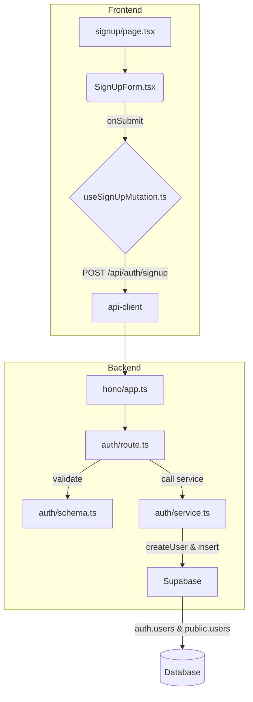

# 회원가입 기능 모듈화 설계

## 1. 개요

기존의 프론트엔드 중심 Supabase 직접 호출 방식의 회원가입 로직을 `AGENTS.md` 가이드라인에 따라 백엔드 API를 사용하는 방식으로 리팩터링합니다. 이를 통해 역할(Role) 선택 기능을 추가하고, Auth 유저 생성과 DB 프로필 생성을 하나의 트랜잭션으로 묶어 데이터 정합성을 보장합니다.

| 모듈 이름 | 위치 | 설명 |
| --- | --- | --- |
| `SignUpForm.tsx` | `src/features/auth/components/` | `react-hook-form`과 `shadcn-ui`를 사용한 회원가입 폼 UI 컴포넌트. |
| `useSignUpMutation.ts` | `src/features/auth/hooks/` | 회원가입 API를 호출하는 React Query `useMutation` 훅. |
| `signup/page.tsx` | `src/app/signup/` | `SignUpForm` 컴포넌트를 렌더링하는 페이지. (단순화) |
| `schema.ts` | `src/features/auth/backend/` | `email`, `password`, `role`을 검증하는 Zod 스키마. |
| `service.ts` | `src/features/auth/backend/` | Supabase Auth 유저 생성 및 `public.users` 프로필 생성을 처리하는 서비스. |
| `route.ts` | `src/features/auth/backend/` | `/api/auth/signup` 엔드포인트를 정의하는 Hono 라우터. |
| `app.ts` | `src/backend/hono/` | 신규 `registerAuthRoutes`를 등록하도록 수정. |

## 2. Diagram

## 3. Implementation Plan

### 1. Backend (`src/features/auth/backend`)

- **`schema.ts`**
    - `SignUpSchema`를 `zod`를 이용해 정의합니다. (`email`, `password`, `role` 포함).
- **`service.ts`**
    - `signUp` 서비스를 구현합니다.
    - `supabase.auth.admin.createUser`를 호출하여 Auth 유저를 생성합니다.
    - 성공 시, 반환된 `auth_id`와 `role`을 `public.users` 테이블에 저장합니다.
    - 두 단계의 생성 과정을 트랜잭션처럼 관리하고 오류 발생 시 롤백 또는 정리 로직을 포함합니다.
- **`route.ts`**
    - `registerAuthRoutes` 함수를 생성하고 `POST /auth/signup` 라우트를 정의합니다.
    - `SignUpSchema`로 요청 body를 검증합니다.
    - `signUp` 서비스를 호출하고 결과를 `respond` 헬퍼로 반환합니다.
- **`src/backend/hono/app.ts` 수정**
    - `registerAuthRoutes(app);`를 추가하여 Hono 앱에 라우트를 등록합니다.

#### Unit Tests (Business Logic)

- **`auth/service.ts`**
    - `[ ]` 성공적인 요청 시 `auth.users`와 `public.users`에 데이터가 정상적으로 생성되어야 함.
    - `[ ]` `public.users` 생성 실패 시 `auth.users` 생성을 롤백 처리해야 함.
    - `[ ]` Supabase 클라이언트에서 에러 발생 시 적절한 에러를 반환해야 함.
- **`auth/route.ts`**
    - `[ ]` 유효하지 않은 `email` 형식의 요청에 대해 400 에러를 반환해야 함.
    - `[ ]` `role` 필드가 누락된 요청에 대해 400 에러를 반환해야 함.
    - `[ ]` 이미 존재하는 이메일로 요청 시 409 에러를 반환해야 함.
    - `[ ]` 성공적인 요청에 대해 201 상태 코드와 생성된 유저 정보를 반환해야 함.

### 2. Frontend (`src/features/auth`, `src/app/signup`)

- **`SignUpForm.tsx` 신규 생성**
    - `react-hook-form`의 `useForm`과 `zodResolver`를 사용하여 `SignUpSchema`와 연동합니다.
    - `shadcn-ui`의 `<Input>`, `<Button>`, `<RadioGroup>`을 사용하여 폼을 구성합니다.
    - `onSubmit` 시 `useSignUpMutation`을 호출합니다.
- **`useSignUpMutation.ts` 신규 생성**
    - `@tanstack/react-query`의 `useMutation`을 사용합니다.
    - mutation 함수는 `@/lib/remote/api-client`를 통해 `POST /api/auth/signup`을 호출합니다.
    - `onSuccess` 시 "인증 이메일을 확인해주세요" 토스트를 표시하고 로그인 페이지로 리디렉션합니다.
    - `onError` 시 에러 메시지를 토스트로 표시합니다.
- **`signup/page.tsx` 리팩터링**
    - 기존의 복잡한 `useState` 및 `handleSubmit` 로직을 모두 제거합니다.
    - 페이지의 주된 역할은 `SignUpForm` 컴포넌트를 렌더링하는 것이 됩니다.

#### QA Sheet (Presentation)

- **`SignUpForm.tsx`**
    - `[ ]` 이메일, 비밀번호, 비밀번호 확인, 역할 선택(`광고주`/`인플루언서`) 필드가 모두 렌더링되는가?
    - `[ ]` 유효하지 않은 이메일 입력 시 실시간으로 에러 메시지가 표시되는가?
    - `[ ]` 비밀번호와 비밀번호 확인이 일치하지 않을 때 에러 메시지가 표시되는가?
    - `[ ]` 필수 필드를 모두 채우기 전까지 '회원가입' 버튼이 비활성화 상태인가?
    - `[ ]` 제출(submitting) 중일 때 버튼이 '등록 중...'으로 바뀌고 비활성화되는가?
    - `[ ]` 회원가입 성공 시 "인증 이메일을 확인해주세요" 메시지가 표시되는가?
    - `[ ]` 이미 가입된 이메일일 경우, API로부터 받은 에러 메시지("이미 가입된 이메일입니다.")가 표시되는가?
