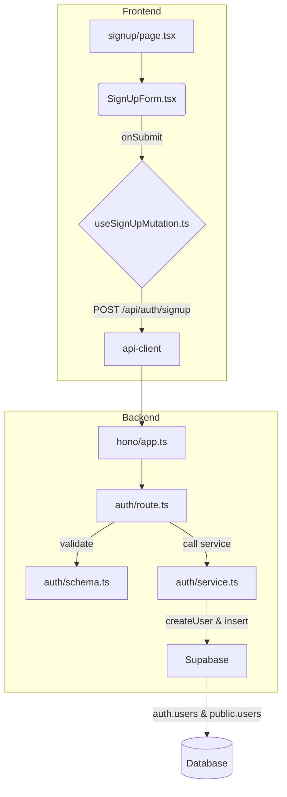

# 회원가입 기능 모듈화 설계 (재작성)

## 1. 개요

`goal.md`의 요구사항에 따라, 회원가입 프로세스를 **1) 핵심 사용자 정보 등록**과 **2) 역할별 프로필 완성**의 두 단계로 분리하여 설계합니다. 본 문서는 이 중 첫 번째 단계인 **핵심 사용자 정보 등록** 기능의 구현 계획을 다룹니다.

`AGENTS.md` 가이드라인에 따라 백엔드 API를 통해 `auth.users`와 `public.users` 테이블에 사용자의 공통 정보를 생성하고, 데이터 정합성을 보장하기 위한 롤백 로직을 포함합니다.

| 모듈 이름 | 위치 | 설명 |
| --- | --- | --- |
| `SignUpForm.tsx` | `src/features/auth/components/` | 공통 정보(이름, 이메일, 연락처, 생년월일, 역할 등) 입력을 위한 UI 컴포넌트. |
| `useSignUpMutation.ts` | `src/features/auth/hooks/` | 회원가입 API(`POST /api/auth/signup`)를 호출하는 React Query `useMutation` 훅. |
| `signup/page.tsx` | `src/app/signup/` | `SignUpForm` 컴포넌트를 렌더링하는 페이지. |
| `schema.ts` | `src/features/auth/backend/` | **`name`, `email`, `phone`, `birthdate`, `role`** 등 공통 정보를 검증하는 Zod 스키마. |
| `service.ts` | `src/features/auth/backend/` | Supabase Auth 유저 생성 및 `public.users` 프로필 생성을 처리하고, 실패 시 롤백을 수행하는 서비스. |
| `route.ts` | `src/features/auth/backend/` | `/api/auth/signup` 엔드포인트를 정의하는 Hono 라우터. |

## 2. Diagram

*아래 다이어그램은 이 문서에서 다루는 '핵심 사용자 정보 등록' 단계의 흐름을 나타냅니다.*

## 3. Implementation Plan

### 1. Backend (`src/features/auth/backend`)

-   **`schema.ts`**
    -   `SignUpSchema`에 `goal.md`와 DB 스키마 기반의 모든 공통 필수 필드(`email`, `password`, `role`, `name`, `phone`, `birthdate`)를 포함하여 정의합니다.
-   **`service.ts`**
    -   `signUp` 서비스는 `SignUpSchema` 타입의 전체 데이터를 인자로 받습니다.
    -   `supabase.auth.admin.createUser`를 호출하여 Auth 유저를 생성합니다.
    -   성공 시, `public.users` 테이블에 `auth_id`와 모든 공통 정보를 저장합니다.
    -   `public.users` 저장 실패 시, 생성했던 Auth 유저를 `deleteUser`로 삭제하는 **보상 트랜잭션 로직을 반드시 구현**합니다.
-   **`route.ts`**
    -   `POST /auth/signup` 라우트는 `SignUpSchema`로 요청 body를 검증합니다.
    -   `signUp` 서비스 호출 후 성공/실패 결과를 `respond` 헬퍼로 반환합니다. (이메일 중복 시 409, 서버 오류 시 500)

### 2. Frontend (`src/features/auth`, `src/app/signup`)

-   **`SignUpForm.tsx`**
    -   `react-hook-form`과 `zodResolver`를 사용합니다.
    -   클라이언트 전용 Zod 스키마를 사용하여 `passwordConfirm` (비밀번호 일치) 및 `termsAccepted` (약관 동의)를 검증합니다.
    -   `Input` (이름, 이메일, 연락처, 생년월일, 비밀번호), `RadioGroup` (역할), `Checkbox` (약관) 필드를 모두 구성합니다.
-   **`useSignUpMutation.ts`**
    -   `api-client`로 API 요청 시, `passwordConfirm`과 `termsAccepted` 필드는 **제외하고** 백엔드 `SignUpSchema`에 맞는 데이터만 전송합니다.
    -   `onSuccess` 시 "인증 이메일을 확인해주세요" 토스트를 표시하고 **로그인 페이지로 리디렉션**합니다.
    -   `onError` 시 API가 반환한 에러 메시지를 토스트로 표시합니다.

### 3. QA Sheet (Presentation)

-   `[ ]` 이름, 이메일, 연락처, 생년월일, 비밀번호, 비밀번호 확인, 역할 선택, 약관 동의 필드가 모두 렌더링되는가?
-   `[ ]` 필수 필드를 모두 채우고 약관에 동의하기 전까지 '회원가입' 버튼이 비활성화 상태인가?
-   `[ ]` 연락처, 생년월일 형식이 올바르지 않을 때 실시간 에러 메시지가 표시되는가?
-   `[ ]` 회원가입 성공 시 "인증 이메일을 확인해주세요" 메시지가 표시되고 로그인 페이지로 이동하는가?
-   `[ ]` 이미 가입된 이메일일 경우, API로부터 받은 에러 메시지("이미 가입된 이메일입니다.")가 표시되는가?

## 4. 후속 단계: 역할별 프로필 완성

본 계획에 따라 회원가입이 완료된 사용자가 로그인하면, **별도의 프로필 완성 로직**이 실행되어야 합니다.

-   **트리거**: 사용자가 로그인했을 때, 전역 상태 또는 `useCurrentUser` 훅 등을 통해 `users` 정보와 `advertiser_profiles` 또는 `influencer_profiles` 정보을 함께 조회합니다.
-   **로직**: 만약 `role`은 있으나 역할별 프로필 정보가 없다면, 프로필 완성 페이지 (`/profile/complete-advertiser` 또는 `/profile/complete-influencer`)로 강제 리디렉션합니다.
-   이 로직은 `(protected)` 그룹의 최상위 `layout.tsx`나 공통 `Provider` 컴포넌트에서 처리하는 것을 권장합니다.