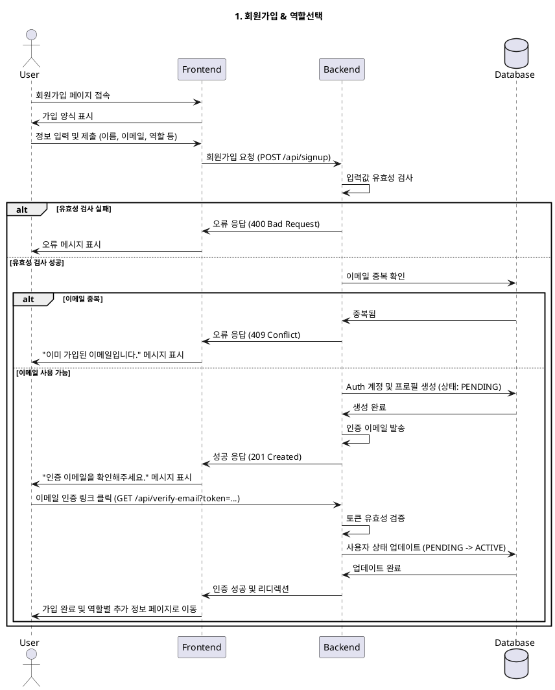

# 1. 회원가입 & 역할선택

- **Primary Actor**: 신규 방문자
- **Precondition**: 사용자는 서비스에 가입되어 있지 않다.
- **Trigger**: 사용자가 '회원가입' 버튼을 클릭한다.

---

### Main Scenario

1. 사용자는 이름, 이메일, 비밀번호를 입력하고, 서비스 약관에 동의한다.
2. 사용자는 자신의 역할(광고주 또는 인플루언서)을 선택한다.
3. 시스템은 입력 정보의 유효성을 검사한다.
4. 시스템은 Auth 계정을 생성하고, 기본 프로필 정보를 데이터베이스에 저장한다.
5. 시스템은 사용자에게 이메일 인증을 요청한다.
6. 사용자가 이메일 내 인증 링크를 클릭하면, 계정이 활성화되고 가입이 완료된다.
7. 가입 완료 후, 선택한 역할에 따라 추가 정보 입력 페이지(광고주/인플루언서 정보 등록)로 이동한다.

---

### Edge Cases

- **이메일 중복**: 이미 가입된 이메일일 경우, 에러 메시지를 표시하고 로그인 페이지로 안내한다.
- **인증 이메일 미수신**: 사용자가 인증 이메일을 받지 못한 경우, 재전송 기능을 제공한다.
- **유효성 검사 실패**: 입력 정보가 형식에 맞지 않을 경우, 실시간으로 오류를 표시한다.

---

### Business Rules

- 하나의 이메일 계정으로 광고주와 인플루언서 역할을 동시에 가질 수 없다.
- 약관 동의는 필수 항목이다.
- 이메일 인증을 완료해야만 서비스의 핵심 기능을 사용할 수 있다.

---

### Sequence Diagram

