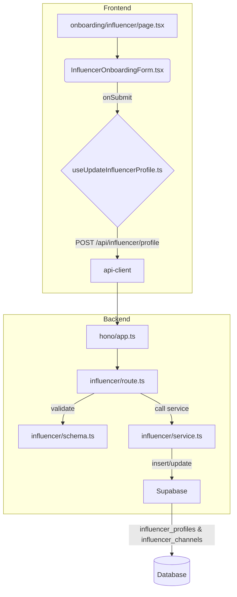

# 인플루언서 정보 등록 기능 모듈화 설계 (MVP)

## 1. 개요

회원가입 후 인플루언서 역할의 사용자가 자신의 SNS 채널 정보를 등록하는 기능입니다. `AGENTS.md` 가이드라인에 따라, 전용 페이지와 백엔드 API를 구현하여 정보를 저장합니다. 동적 폼 처리를 위해 `react-hook-form`의 `useFieldArray`를 사용합니다.

| 모듈 이름 | 위치 | 설명 |
| --- | --- | --- |
| `InfluencerOnboardingForm.tsx` | `src/features/influencer/components/` | SNS 채널(동적 추가/삭제)을 입력받는 폼 UI. |
| `useUpdateInfluencerProfile.ts` | `src/features/influencer/hooks/` | 인플루언서 프로필 정보를 백엔드에 제출하는 React Query `useMutation` 훅. |
| `page.tsx` | `src/app/(protected)/onboarding/influencer/` | `InfluencerOnboardingForm`을 렌더링하는 온보딩 페이지. |
| `schema.ts` | `src/features/influencer/backend/` | 채널 정보 유효성을 검증하는 Zod 스키마. |
| `service.ts` | `src/features/influencer/backend/` | `influencer_profiles`와 `influencer_channels` 테이블에 데이터를 저장하는 서비스. |
| `route.ts` | `src/features/influencer/backend/` | `POST /api/influencer/profile` 엔드포인트를 정의하는 Hono 라우터. |

## 2. Diagram

## 3. Implementation Plan

### 1. Backend (`src/features/influencer/backend`)

- **`schema.ts`**: `channels` 배열(`channel_type`, `channel_name`, `channel_url`, `follower_count`)에 대한 Zod 스키마를 정의합니다.
- **`service.ts`**: `updateInfluencerProfile` 서비스를 구현합니다. 로그인된 사용자의 `user_id`를 기반으로 `influencer_profiles`에 레코드를 생성하고, `influencer_channels`에 채널 목록을 저장합니다.
- **`route.ts`**: `registerInfluencerRoutes`를 생성하고 `POST /api/influencer/profile` 라우트를 정의합니다. 이 라우트는 `withSupabase` 미들웨어를 통해 인증된 사용자만 접근 가능해야 합니다.
- **`src/backend/hono/app.ts`**: `registerInfluencerRoutes`를 호출하도록 수정합니다.

#### Unit Tests (Business Logic)

- **`influencer/service.ts`**
    - `[ ]` 유효한 데이터로 요청 시 `influencer_profiles`와 `influencer_channels` 테이블에 데이터가 정확히 저장되어야 함.
    - `[ ]` 이미 프로필이 존재하는 사용자가 요청 시, 정보를 업데이트해야 함 (upsert 로직).
    - `[ ]` 채널 목록이 비어있는 요청도 정상 처리되어야 함.

### 2. Frontend

- **`InfluencerOnboardingForm.tsx`**: `react-hook-form`의 `useFieldArray`를 사용하여 SNS 채널을 동적으로 추가/삭제하는 UI를 구현합니다. `shadcn-ui`의 `<Input>`, `<Button>`, `<Select>`를 사용합니다.
- **`useUpdateInfluencerProfile.ts`**: 프로필 정보를 받아 `/api/influencer/profile`로 POST 요청을 보내는 `useMutation` 훅을 생성합니다. 성공 시 성공 토스트를 보여주고 대시보드 페이지로 리디렉션하며, 실패 시 에러 토스트를 표시합니다.
- **`page.tsx`**: 신규 경로 `src/app/(protected)/onboarding/influencer/page.tsx`를 생성합니다. 이 페이지는 `InfluencerOnboardingForm`을 렌더링하고, 접근 제어는 `(protected)` 레이아웃을 통해 처리됩니다.

#### QA Sheet (Presentation)

- **`InfluencerOnboardingForm.tsx`**
    - `[ ]` '채널 추가' 버튼 클릭 시 새로운 SNS 채널 입력 필드(타입 선택, URL 입력) 한 쌍이 나타나는가?
    - `[ ]` '삭제' 버튼 클릭 시 해당 채널 입력 필드가 사라지는가?
    - `[ ]` 유효하지 않은 URL 입력 시 실시간으로 에러 메시지가 표시되는가?
    - `[ ]` 제출 성공 시 다음 페이지(e.g., 대시보드)로 이동하는가?
