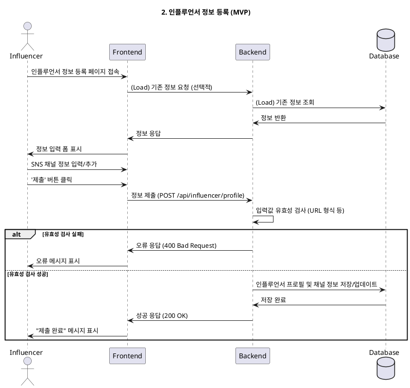

# 2. 인플루언서 정보 등록 (MVP)

- **Primary Actor**: 가입을 완료한 인플루언서
- **Precondition**:
    - 사용자는 '인플루언서' 역할로 가입을 완료했다.
    - 사용자는 아직 인플루언서 상세 정보를 등록하지 않았다.
- **Trigger**: 회원가입 직후 또는 '마이페이지'에서 정보 등록을 시작한다.

---

### Main Scenario

1.  사용자는 인플루언서 정보 입력 페이지에 접속한다.
2.  사용자는 SNS 채널 정보(채널 유형, URL) 등을 입력한다.
3.  사용자는 '채널 추가' 버튼을 통해 여러 개의 SNS 채널을 등록할 수 있다. (0개도 가능)
4.  사용자가 '제출' 버튼을 클릭한다.
5.  시스템은 입력된 정보(URL 유효성 등)를 검증한다.
6.  시스템은 검증된 정보를 `influencer_profiles` 및 `influencer_channels` 테이블에 저장한다.
7.  사용자에게 "정보가 성공적으로 제출되었습니다."와 같은 피드백을 표시한다.

---

### Edge Cases

- **잘못된 URL 형식**: SNS 채널 URL이 유효하지 않은 형식일 경우, 오류 메시지를 표시한다.

---

### Business Rules

- (MVP 범위에서 제외)

---

### Sequence Diagram

