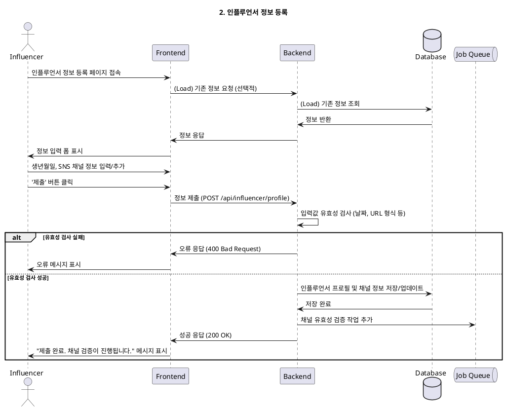

# 2. 인플루언서 정보 등록

- **Primary Actor**: 가입을 완료한 인플루언서
- **Precondition**:
    - 사용자는 '인플루언서' 역할로 가입을 완료했다.
    - 사용자는 아직 인플루언서 상세 정보를 등록하지 않았다.
- **Trigger**: 회원가입 직후 또는 '마이페이지'에서 정보 등록을 시작한다.

---

### Main Scenario

1. 사용자는 인플루언서 정보 입력 페이지에 접속한다.
2. 사용자는 생년월일, SNS 채널 정보(채널 유형, URL) 등을 입력한다.
3. 사용자는 '채널 추가' 버튼을 통해 여러 개의 SNS 채널을 등록할 수 있다.
4. 사용자가 '제출' 버튼을 클릭한다.
5. 시스템은 입력된 정보(날짜 형식, URL 유효성 등)를 검증한다.
6. 시스템은 검증된 정보를 `influencer_profiles` 및 `influencer_channels` 테이블에 저장한다.
7. 시스템은 채널의 유효성을 확인하기 위한 비동기 검증 작업을 시작한다.
8. 사용자에게 "정보가 성공적으로 제출되었으며, 채널 검증이 진행 중입니다."와 같은 피드백을 표시한다.

---

### Edge Cases

- **잘못된 URL 형식**: SNS 채널 URL이 유효하지 않은 형식일 경우, 오류 메시지를 표시한다.
- **중복된 채널**: 동일한 SNS 채널을 중복하여 등록하려 할 경우, 오류를 알린다.
- **임시 저장**: 사용자가 필수 정보를 모두 입력하지 않고 페이지를 벗어나려 할 경우, 임시 저장 옵션을 제공할 수 있다.

---

### Business Rules

- 인플루언서는 최소 하나 이상의 SNS 채널을 등록해야 한다.
- 등록된 채널은 시스템의 비동기 검증을 통과해야 '검증 완료' 상태가 된다.
- 채널 검증이 완료되어야만 체험단에 지원할 수 있다.

---

### Sequence Diagram

