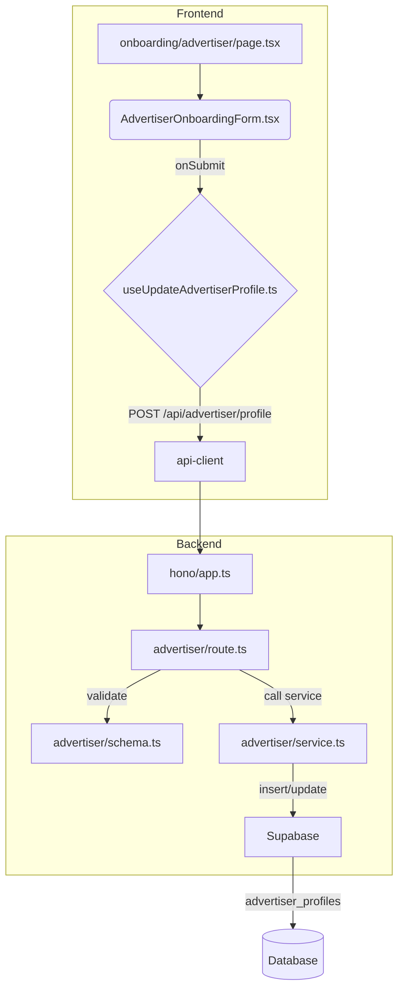

# 광고주 정보 등록 기능 모듈화 설계 (MVP)

## 1. 개요

회원가입 후 광고주 역할의 사용자가 업체 정보(업체명, 사업자등록번호 등)를 등록하는 기능입니다. 인플루언서 정보 등록 플로우와 유사하게, 전용 온보딩 페이지와 백엔드 API를 구현하여 프로필을 생성/업데이트합니다.

| 모듈 이름 | 위치 | 설명 |
| --- | --- | --- |
| `AdvertiserOnboardingForm.tsx` | `src/features/advertiser/components/` | 광고주 업체 정보를 입력받는 폼 UI 컴포넌트. |
| `useUpdateAdvertiserProfile.ts` | `src/features/advertiser/hooks/` | 업체 정보를 백엔드에 제출하는 React Query `useMutation` 훅. |
| `page.tsx` | `src/app/(protected)/onboarding/advertiser/` | `AdvertiserOnboardingForm`을 렌더링하는 페이지. |
| `schema.ts` | `src/features/advertiser/backend/` | 업체 정보의 유효성을 검증하는 Zod 스키마. |
| `service.ts` | `src/features/advertiser/backend/` | `advertiser_profiles` 테이블에 데이터를 저장/수정하는 서비스. |
| `route.ts` | `src/features/advertiser/backend/` | `POST /api/advertiser/profile` 엔드포인트를 정의하는 Hono 라우터. |

## 2. Diagram

## 3. Implementation Plan

### 1. Backend (`src/features/advertiser/backend`)

- **`schema.ts`**: `company_name`, `business_number` 등 `advertiser_profiles` 테이블에 명시된 모든 필드들에 대한 Zod 스키마를 정의합니다.
- **`service.ts`**: `updateAdvertiserProfile` 서비스를 구현합니다. 인증된 사용자의 `user_id`를 사용하여 `advertiser_profiles` 테이블에 데이터를 `upsert` 합니다.
- **`route.ts`**: `registerAdvertiserRoutes`를 생성하고 `POST /api/advertiser/profile` 라우트를 정의합니다. 인증된 광고주 사용자만 접근 가능하도록 미들웨어에서 확인해야 합니다.
- **`src/backend/hono/app.ts`**: `registerAdvertiserRoutes`를 호출하도록 수정합니다.

#### Unit Tests (Business Logic)

- **`advertiser/service.ts`**
    - `[ ]` 유효한 데이터로 요청 시 `advertiser_profiles` 테이블에 데이터가 정확히 저장되어야 함.
    - `[ ]` 사업자등록번호가 중복될 경우, 서비스 레벨에서 `Conflict` 에러를 반환해야 함. (DB 제약조건 활용)
    - `[ ]` 이미 프로필이 존재하는 사용자가 요청 시, 정보를 업데이트해야 함.

### 2. Frontend

- **`AdvertiserOnboardingForm.tsx`**: `react-hook-form`과 `zodResolver`를 사용하여 업체 정보 입력 폼을 구현합니다. `shadcn-ui` 컴포넌트를 활용합니다.
- **`useUpdateAdvertiserProfile.ts`**: 프로필 정보를 받아 `/api/advertiser/profile`로 POST 요청을 보내는 `useMutation` 훅을 생성합니다. 성공 시 광고주 대시보드로 이동합니다.
- **`page.tsx`**: 신규 경로 `src/app/(protected)/onboarding/advertiser/page.tsx`를 생성하고, `AdvertiserOnboardingForm`을 렌더링합니다.

#### QA Sheet (Presentation)

- **`AdvertiserOnboardingForm.tsx`**
    - `[ ]` 업체명, 사업자등록번호, 주소, 업장 전화번호, 대표자명 등 필수 입력 필드가 모두 렌더링되는가?
    - `[ ]` 사업자등록번호 형식이 `xxx-xx-xxxxx`와 맞지 않을 경우 실시간 에러 메시지가 표시되는가?
    - `[ ]` 필수 필드를 모두 채우기 전까지 '제출' 버튼이 비활성화되는가?
    - `[ ]` 제출 성공 시 광고주 대시보드 페이지로 이동하는가?
    - `[ ]` 백엔드에서 중복 사업자 번호 에러(409)를 반환했을 때, 해당 에러 메시지를 사용자에게 보여주는가?
