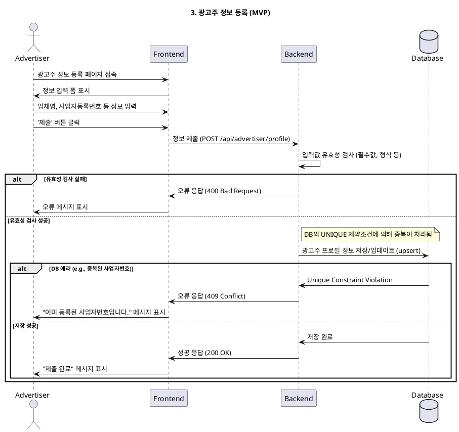

# 3. 광고주 정보 등록 (MVP)

- **Primary Actor**: 가입을 완료한 광고주
- **Precondition**:
    - 사용자는 '광고주' 역할로 가입을 완료했다.
    - 사용자는 아직 광고주 상세 정보를 등록하지 않았다.
- **Trigger**: 회원가입 직후 또는 '마이페이지'에서 정보 등록을 시작한다.

---

### Main Scenario

1.  사용자는 광고주 정보 입력 페이지에 접속한다.
2.  사용자는 업체명, 사업자등록번호, 주소, 업장 전화번호, 대표자명 등 DB 스키마에 명시된 모든 정보를 입력한다.
3.  사용자가 '제출' 버튼을 클릭한다.
4.  시스템은 입력된 정보의 형식과 유효성을 검증한다. (e.g., 사업자등록번호 형식)
5.  시스템은 검증된 정보를 `advertiser_profiles` 테이블에 저장한다.
6.  사용자에게 "정보가 성공적으로 제출되었습니다."와 같은 피드백을 표시한다.

---

### Edge Cases

- **잘못된 사업자등록번호 형식**: 사업자등록번호가 표준 형식에 맞지 않을 경우, 실시간으로 오류를 알린다.
- **중복된 사업자등록번호**: 이미 등록된 사업자등록번호일 경우, 제출을 차단하고 오류 메시지를 표시한다. (DB `UNIQUE` 제약조건 활용)

---

### Business Rules

- 하나의 사업자등록번호는 하나의 계정에만 연결될 수 있다.
- 필수 정보를 모두 입력해야 제출이 가능하다.

---

### Sequence Diagram

