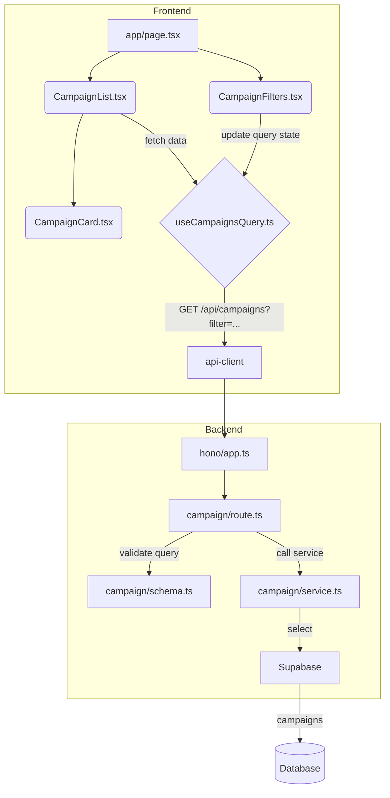

# 체험단 목록 탐색 기능 모듈화 설계

## 1. 개요

서비스의 메인 페이지에서 모집 중인 체험단 목록을 사용자에게 보여주는 기능입니다. 사용자는 필터링, 정렬, 무한 스크롤을 통해 목록을 탐색할 수 있습니다. 이 기능은 인증 여부와 관계없이 모든 사용자에게 제공됩니다.

| 모듈 이름 | 위치 | 설명 |
| --- | --- | --- |
| `CampaignList.tsx` | `src/features/campaign/components/` | `useCampaignsQuery`를 통해 얻어온 체험단 목록을 렌더링하는 컴포넌트. |
| `CampaignCard.tsx` | `src/features/campaign/components/` | 개별 체험단 정보를 요약하여 보여주는 카드 컴포넌트. |
| `CampaignFilters.tsx` | `src/features/campaign/components/` | 지역, 카테고리 등 목록을 필터링하기 위한 컨트롤 UI. |
| `useCampaignsQuery.ts` | `src/features/campaign/hooks/` | 체험단 목록을 서버에서 조회하는 React Query `useInfiniteQuery` 훅. |
| `page.tsx` | `src/app/` | 홈 페이지. `CampaignFilters`와 `CampaignList`를 조합하여 렌더링. |
| `schema.ts` | `src/features/campaign/backend/` | 목록 조회 시 사용될 쿼리 파라미터(정렬, 필터, 페이지네이션)의 Zod 스키마. |
| `service.ts` | `src/features/campaign/backend/` | 쿼리 파라미터를 기반으로 `campaigns` 테이블을 조회하는 서비스. |
| `route.ts` | `src/features/campaign/backend/` | `GET /api/campaigns` 엔드포인트를 정의하는 Hono 라우터. |

## 2. Diagram

## 3. Implementation Plan

### 1. Backend (`src/features/campaign/backend`)

- **`schema.ts`**: `GET /api/campaigns`의 쿼리 파라미터(e.g., `limit`, `cursor`, `sortBy`, `filterBy`)를 위한 Zod 스키마를 정의합니다.
- **`service.ts`**: `getCampaigns` 서비스를 구현합니다. Zod 스키마로 검증된 쿼리 파라미터를 받아 Supabase 클라이언트로 `campaigns` 테이블을 동적으로 조회하는 로직을 작성합니다. `status`가 'recruiting'인 캠페인만 기본적으로 조회합니다.
- **`route.ts`**: `registerCampaignRoutes`를 생성하고 `GET /api/campaigns` 라우트를 정의합니다.
- **`src/backend/hono/app.ts`**: `registerCampaignRoutes`를 호출하도록 수정합니다.

#### Unit Tests (Business Logic)

- **`campaign/service.ts`**
    - `[ ]` 파라미터 없이 호출 시, 모집 중인 캠페인 목록을 최신순으로 반환해야 함.
    - `[ ]` `sortBy=popular` 파라미터 적용 시, 특정 기준(e.g., 지원자 수)으로 정렬되어야 함.
    - `[ ]` 페이지네이션(cursor-based)이 정확하게 동작해야 함.

### 2. Frontend

- **`useCampaignsQuery.ts`**: `useInfiniteQuery`를 사용하여 `/api/campaigns`를 호출합니다. 필터/정렬 상태를 쿼리 키로 사용하여 상태 변경 시 자동으로 데이터를 다시 불러오도록 설정합니다.
- **`CampaignCard.tsx`**: `title`, `benefit`, `location` 등 캠페인의 주요 정보를 표시하는 재사용 가능한 카드 컴포넌트를 만듭니다. 클릭 시 `Link` 컴포넌트를 통해 상세 페이지로 이동합니다.
- **`CampaignFilters.tsx`**: 필터와 정렬 옵션을 선택할 수 있는 UI를 제공합니다. 선택된 값은 Zustand나 Context API를 통해 `useCampaignsQuery`가 있는 상위 컴포넌트와 상태를 공유합니다.
- **`CampaignList.tsx`**: `useCampaignsQuery`의 데이터를 받아 `CampaignCard`를 반복 렌더링합니다. 무한 스크롤을 위해 `react-intersection-observer` 등을 사용하여 스크롤이 끝에 닿았을 때 `fetchNextPage`를 호출합니다.
- **`app/page.tsx`**: 기존 내용을 정리하고, `CampaignFilters`와 `CampaignList` 컴포넌트를 배치하여 홈 페이지를 구성합니다.

#### QA Sheet (Presentation)

- **`CampaignList.tsx` & `CampaignCard.tsx`**
    - `[ ]` 캠페인 목록이 카드 형태로 정상적으로 표시되는가?
    - `[ ]` 페이지 하단으로 스크롤 시 다음 페이지의 데이터가 자연스럽게 로드되는가? (무한 스크롤)
    - `[ ]` 모집 중인 캠페인이 없을 때 "모집 중인 체험단이 없습니다." 메시지가 표시되는가?
    - `[ ]` 캠페인 카드를 클릭하면 올바른 상세 페이지(`/campaigns/{id}`)로 이동하는가?
- **`CampaignFilters.tsx`**
    - `[ ]` 정렬 옵션(최신순, 인기순)을 변경하면 목록이 그에 맞게 재정렬되는가?
    - `[ ]` 필터 옵션(지역, 카테고리)을 선택하면 목록이 필터링되는가?
