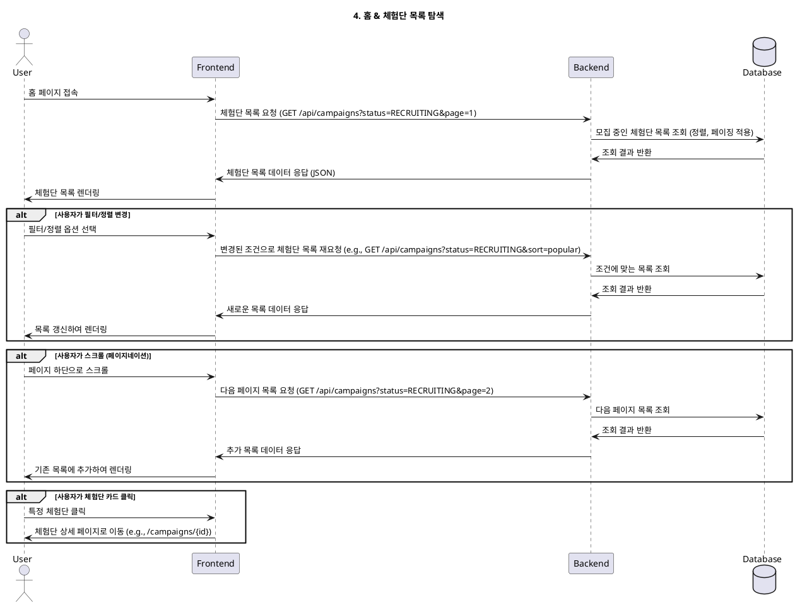

# 4. 홈 & 체험단 목록 탐색

- **Primary Actor**: 모든 사용자 (로그인 여부 무관)
- **Precondition**: 사용자가 서비스에 접근할 수 있다.
- **Trigger**: 사용자가 메인 페이지(홈)에 접속한다.

---

### Main Scenario

1. 사용자가 홈 페이지에 접속한다.
2. 시스템은 현재 '모집 중'인 체험단 목록을 기본 정렬 순서(e.g., 최신순)에 따라 조회한다.
3. 조회된 체험단 목록이 페이지에 표시된다. 각 항목에는 대표 이미지, 체험단 제목, 지역, 제공 혜택 등이 요약되어 보여진다.
4. 사용자는 스크롤을 통해 더 많은 체험단 목록을 로드할 수 있다 (무한 스크롤 또는 페이지네이션).
5. 사용자는 필터(지역, 카테고리 등)나 정렬(인기순, 마감 임박순 등) 옵션을 사용하여 목록을 재정렬할 수 있다.
6. 사용자가 특정 체험단 카드를 클릭하면, 해당 체험단의 상세 페이지로 이동한다.

---

### Edge Cases

- **모집 중인 체험단 없음**: 현재 모집 중인 체험단이 없을 경우, "현재 모집 중인 체험단이 없습니다."와 같은 메시지를 표시한다.
- **네트워크 오류**: 데이터를 불러오는 중 네트워크 문제가 발생하면, 오류 메시지와 함께 재시도 옵션을 제공한다.

---

### Business Rules

- 기본적으로 '모집 중' 상태인 체험단만 목록에 노출된다.
- 체험단 목록은 누구나 볼 수 있지만, 지원하려면 인플루언서로 로그인 및 정보 등록이 완료되어야 한다.
- 광고 배너 등 다른 컨텐츠가 목록과 함께 표시될 수 있다.

---

### Sequence Diagram

