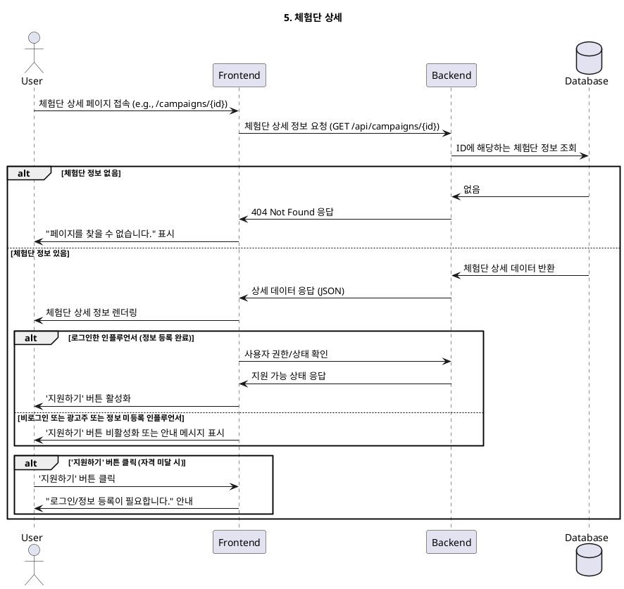

# 5. 체험단 상세

- **Primary Actor**: 모든 사용자
- **Precondition**: 사용자가 체험단 목록에서 특정 체험단을 선택했다.
- **Trigger**: 체험단 목록의 특정 항목을 클릭하여 상세 페이지로 진입한다.

---

### Main Scenario

1. 사용자가 체험단 상세 페이지에 접속한다.
2. 시스템은 URL의 ID를 기반으로 해당 체험단의 모든 상세 정보(모집 기간, 제공 혜택, 미션 내용, 업체 정보, 지도 등)를 조회한다.
3. 조회된 정보가 페이지에 렌더링된다.
4. 시스템은 현재 접속한 사용자의 상태를 확인한다.
5. **Case 1: 로그인하지 않은 사용자 또는 광고주 사용자**: '지원하기' 버튼이 비활성화되거나 "인플루언서로 로그인 후 지원 가능합니다."와 같은 메시지가 표시된다.
6. **Case 2: 정보 등록을 완료한 인플루언서 사용자**: '지원하기' 버튼이 활성화된다.
7. **Case 3: 정보 등록을 완료하지 않은 인플루언서 사용자**: '지원하기' 버튼 클릭 시, "인플루언서 정보 등록을 먼저 완료해주세요." 라는 메시지와 함께 정보 등록 페이지로 안내한다.

---

### Edge Cases

- **존재하지 않는 체험단**: 유효하지 않은 ID로 접근 시, "존재하지 않는 체험단입니다." (404 Not Found) 페이지를 표시한다.
- **모집 기간 종료**: 모집 기간이 이미 종료된 체험단일 경우, '지원하기' 버튼을 비활성화하고 "모집이 마감된 체험단입니다." 메시지를 표시한다.

---

### Business Rules

- 체험단 상세 정보는 누구나 조회할 수 있다.
- '지원하기' 기능은 '인플루언서' 역할을 가지며, 프로필 및 채널 등록/검증을 완료한 사용자만 사용할 수 있다.
- 모집 기간이 아닐 경우 지원할 수 없다.

---

### Sequence Diagram

