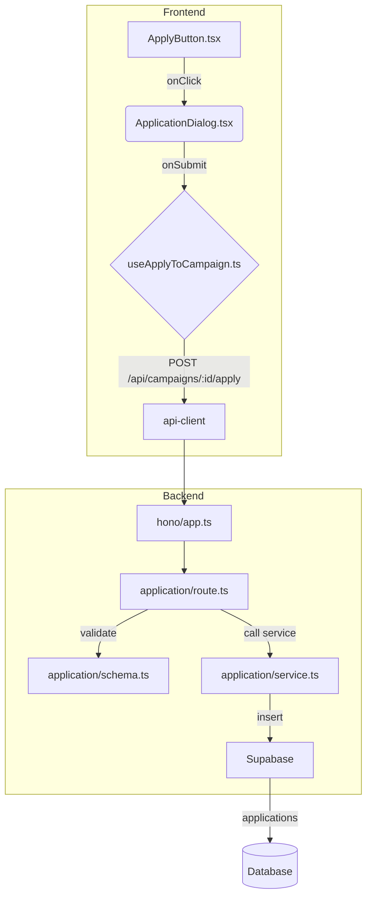

# 체험단 지원 기능 모듈화 설계

## 1. 개요

자격을 갖춘 인플루언서가 체험단에 지원하는 기능입니다. 사용자가 '지원하기' 버튼을 누르면 다이얼로그(Dialog)가 열리고, 간단한 정보를 입력하여 지원서를 제출합니다. 백엔드는 중복 지원을 방지하고 `applications` 테이블에 지원 내역을 기록합니다.

| 모듈 이름 | 위치 | 설명 |
| --- | --- | --- |
| `ApplicationDialog.tsx` | `src/features/application/components/` | 지원서 제출 폼을 담고 있는 `shadcn-ui`의 `Dialog` 컴포넌트. |
| `useApplyToCampaign.ts` | `src/features/application/hooks/` | 지원서 데이터를 백엔드에 제출하는 React Query `useMutation` 훅. |
| `ApplyButton.tsx` | `src/features/campaign/components/` | (수정) 클릭 시 `ApplicationDialog`를 열도록 상태 관리 로직 추가. |
| `schema.ts` | `src/features/application/backend/` | 지원서 제출 데이터(`message`, `visit_date`)의 Zod 스키마. |
| `service.ts` | `src/features/application/backend/` | `applications` 테이블에 지원 레코드를 생성하는 서비스. |
| `route.ts` | `src/features/application/backend/` | `POST /api/campaigns/:id/apply` 엔드포인트를 정의하는 Hono 라우터. |

## 2. Diagram

## 3. Implementation Plan

### 1. Backend (`src/features/application/backend`)

- **`schema.ts`**: 지원서 제출에 필요한 `message`, `visit_date` 등의 필드를 검증하는 Zod 스키마를 정의합니다.
- **`service.ts`**: `createApplication` 서비스를 구현합니다. 인증된 인플루언서의 ID와 캠페인 ID를 사용하여 `applications` 테이블에 레코드를 `insert` 합니다. DB의 `UNIQUE` 제약조건 위반 에러를 catch하여 중복 지원(409 Conflict)으로 처리합니다. 또한, 캠페인이 'recruiting' 상태인지 확인합니다.
- **`route.ts`**: `registerApplicationRoutes`를 생성하고 `POST /api/campaigns/:id/apply` 라우트를 정의합니다. 인증된 인플루언서만 호출할 수 있어야 합니다.
- **`src/backend/hono/app.ts`**: `registerApplicationRoutes`를 호출하도록 수정합니다.

#### Unit Tests (Business Logic)

- **`application/service.ts`**
    - `[ ]` 유효한 요청 시 `applications` 테이블에 데이터가 정상적으로 생성되어야 함.
    - `[ ]` 동일한 유저가 동일한 캠페인에 재지원 시, 중복 에러(e.g., 409)를 반환해야 함.
    - `[ ]` 모집 기간이 종료된 캠페인에 지원 시, 마감 에러(e.g., 400)를 반환해야 함.

### 2. Frontend

- **`ApplicationDialog.tsx`**: `shadcn-ui`의 `Dialog`와 `react-hook-form`을 사용하여 지원서 폼을 만듭니다. `useApplyToCampaign` 훅을 사용하여 `onSubmit`을 처리합니다.
- **`useApplyToCampaign.ts`**: `/api/campaigns/:id/apply`로 POST 요청을 보내는 `useMutation` 훅을 생성합니다. 성공 시, "지원이 완료되었습니다." 토스트를 띄우고 다이얼로그를 닫습니다. 에러 발생 시(중복, 마감 등) 해당 메시지를 토스트로 보여줍니다.
- **`ApplyButton.tsx` 수정**: `useState`를 사용하여 다이얼로그의 open/close 상태를 관리합니다. 버튼 클릭 시 다이얼로그를 열도록 수정합니다.

#### QA Sheet (Presentation)

- **`ApplicationDialog.tsx`**
    - `[ ]` '지원하기' 버튼 클릭 시 지원서 다이얼로그가 정상적으로 열리는가?
    - `[ ]` 다이얼로그 내에 '각오 한마디', '방문 희망일' 등의 입력 필드가 표시되는가?
    - `[ ]` '제출' 버튼 클릭 후 성공 시 "지원이 완료되었습니다." 메시지가 뜨고 다이얼로그가 닫히는가?
    - `[ ]` 이미 지원한 캠페인일 경우 "이미 지원한 체험단입니다." 에러 메시지가 표시되는가?
    - `[ ]` 다이얼로그 외부를 클릭하거나 '취소' 버튼을 누르면 다이얼로그가 닫히는가?
