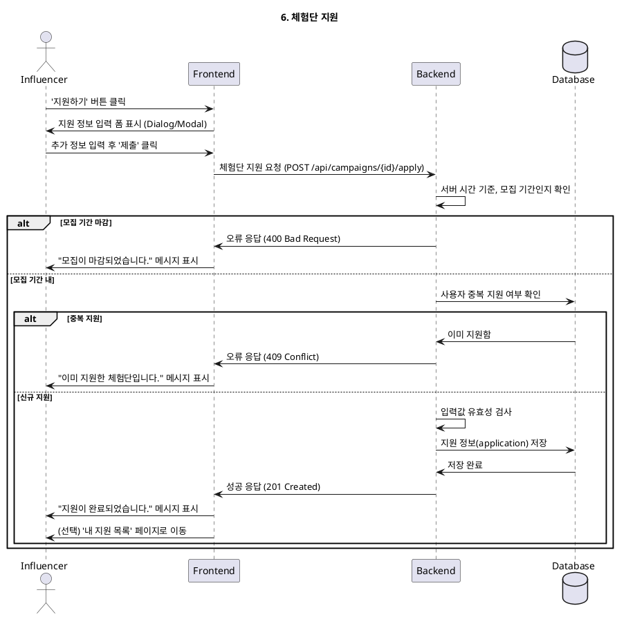

# 6. 체험단 지원

- **Primary Actor**: 자격 있는 인플루언서
- **Precondition**:
    - 사용자는 '인플루언서'로 로그인했으며, 프로필 및 채널 등록/검증을 완료했다.
    - 사용자는 모집 중인 체험단의 상세 페이지를 보고 있다.
- **Trigger**: 사용자가 '지원하기' 버튼을 클릭한다.

---

### Main Scenario

1. 사용자가 '지원하기' 버튼을 클릭하면, 지원 정보 입력 다이얼로그(or 페이지)가 표시된다.
2. 사용자는 '각오 한마디', '방문 희망일' 등 추가 정보를 입력한다.
3. 사용자가 '제출' 버튼을 클릭한다.
4. 시스템은 현재 시간이 모집 기간 내인지 다시 한번 확인한다.
5. 시스템은 해당 사용자가 이 체험단에 이미 지원했는지 중복 여부를 확인한다.
6. 유효성 검사를 통과하면, 시스템은 지원 정보를 `applications` 테이블에 저장한다.
7. 사용자에게 "체험단 지원이 완료되었습니다." 라는 성공 메시지를 보여준다.
8. 사용자는 '내 지원 목록' 페이지로 이동하여 지원 현황을 확인할 수 있다.

---

### Edge Cases

- **중복 지원**: 이미 지원한 체험단에 다시 지원을 시도할 경우, "이미 지원한 체험단입니다." 라는 메시지를 표시한다.
- **모집 기간 마감**: 지원서 제출 시점에 모집 기간이 종료되었을 경우, "모집 기간이 종료되어 지원할 수 없습니다." 라는 메시지를 표시한다.
- **필수 정보 누락**: '각오 한마디' 등 필수 입력 항목을 누락하고 제출할 경우, 오류를 표시한다.

---

### Business Rules

- 하나의 체험단에는 한 번만 지원할 수 있다.
- 모집 기간 내에만 지원서 제출이 가능하다.
- 지원 시점에 인플루언서 자격(프로필, 채널 검증 완료)이 유효해야 한다.

---

### Sequence Diagram

