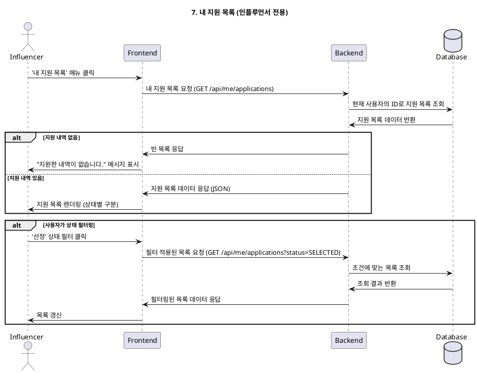

# 7. 내 지원 목록 (인플루언서 전용)

- **Primary Actor**: 인플루언서
- **Precondition**: 사용자는 '인플루언서'로 로그인했다.
- **Trigger**: 사용자가 메뉴에서 '내 지원 목록'을 클릭한다.

---

### Main Scenario

1. 사용자가 '내 지원 목록' 페이지에 접속한다.
2. 시스템은 현재 로그인한 사용자가 지원한 모든 체험단 목록을 조회한다.
3. 목록은 각 지원 건의 상태(신청완료, 선정, 반려, 리뷰완료 등)와 함께 표시된다.
4. 사용자는 상태(e.g., '선정')를 기준으로 목록을 필터링할 수 있다.
5. 사용자가 목록의 특정 항목을 클릭하면, 해당 체험단의 상세 페이지 또는 지원 상세 정보 페이지로 이동한다.

---

### Edge Cases

- **지원 내역 없음**: 사용자가 아직 아무 체험단에도 지원하지 않았을 경우, "지원한 내역이 없습니다." 라는 메시지를 표시한다.
- **네트워크 오류**: 목록을 불러오는 중 오류가 발생하면, 재시도 옵션을 제공한다.

---

### Business Rules

- 자신이 지원한 내역만 조회할 수 있다.
- 지원 상태는 광고주가 관리하며, 인플루언서는 조회만 가능하다.
- '선정'된 체험단에 대해서는 '리뷰 등록' 등 추가적인 액션 버튼이 노출될 수 있다.

---

### Sequence Diagram

