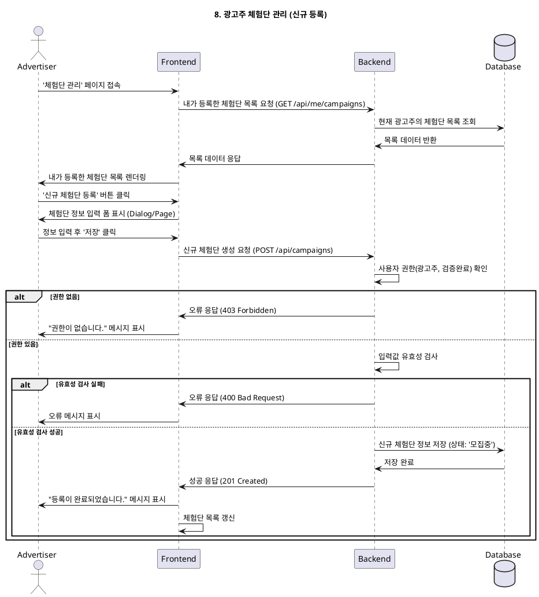

# 8. 광고주 체험단 관리

- **Primary Actor**: 광고주
- **Precondition**:
    - 사용자는 '광고주'로 로그인했으며, 프로필(사업자 정보) 등록 및 검증을 완료했다.
- **Trigger**: 사용자가 메뉴에서 '체험단 관리'를 클릭한다.

---

### Main Scenario

1. 사용자가 '체험단 관리' 페이지에 접속한다.
2. 시스템은 현재 로그인한 광고주가 생성한 모든 체험단 목록을 조회한다.
3. 목록에는 각 체험단의 상태(모집중, 모집종료, 선정완료 등)가 표시된다.
4. 사용자는 '신규 체험단 등록' 버튼을 클릭하여 새 체험단 생성을 시작할 수 있다.
5. (신규 등록) 다이얼로그 또는 새 페이지에서 체험단 정보(제목, 내용, 모집 기간, 미션 등)를 입력하고 '저장'한다.
6. 시스템은 입력 정보의 유효성을 검사하고, 유효할 경우 `campaigns` 테이블에 새로운 레코드를 생성한다.
7. 새로운 체험단이 목록에 추가되고, 상태는 '모집중'으로 설정된다.
8. 사용자에게 "신규 체험단이 성공적으로 등록되었습니다." 라는 메시지를 표시한다.

---

### Edge Cases

- **필수 정보 누락**: 체험단 생성 시 필수 항목(e.g., 모집 기간)을 입력하지 않으면 오류를 표시한다.
- **권한 없음**: 프로필 검증이 완료되지 않은 광고주가 접근 시, "사업자 정보 검증을 먼저 완료해주세요." 라는 메시지와 함께 접근을 차단한다.

---

### Business Rules

- 광고주는 자신이 생성한 체험단만 관리할 수 있다.
- 체험단을 생성하려면 광고주 프로필(사업자 정보)이 '검증 완료' 상태여야 한다.
- 신규 체험단은 생성 즉시 '모집중' 상태가 되어 인플루언서들에게 노출된다.

---

### Sequence Diagram

