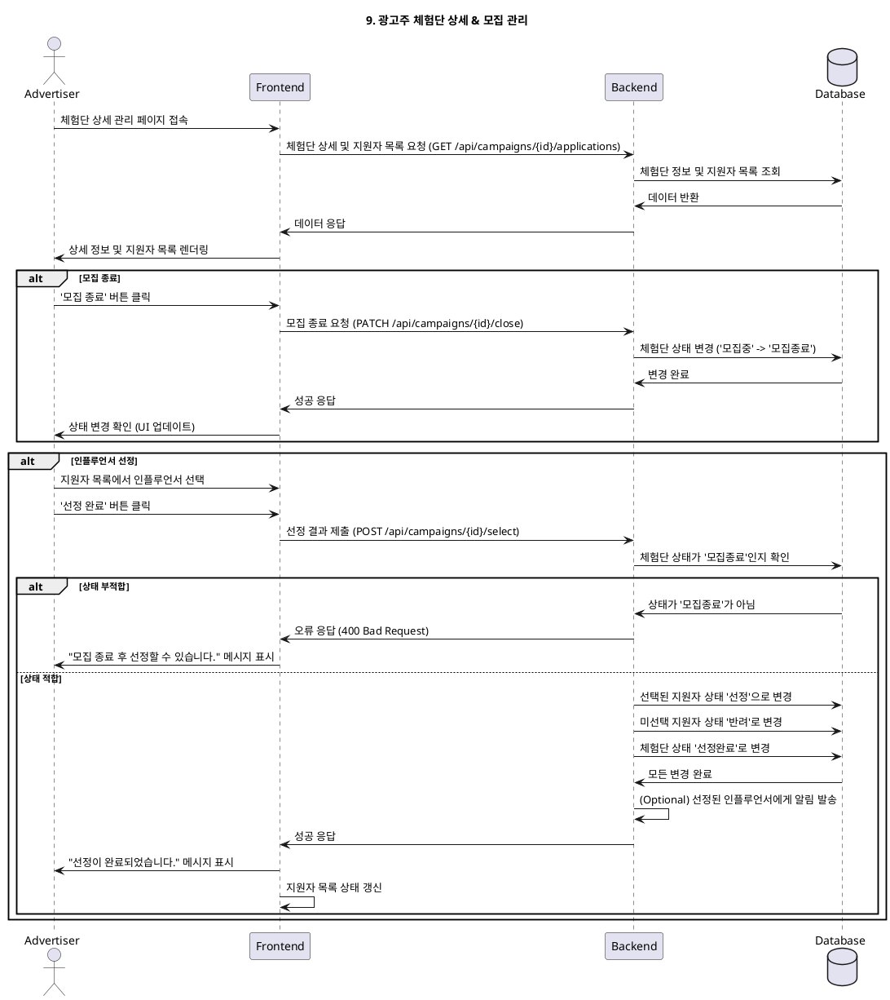

# 9. 광고주 체험단 상세 & 모집 관리

- **Primary Actor**: 광고주
- **Precondition**:
    - 사용자는 '광고주'로 로그인했다.
    - 사용자는 자신이 등록한 체험단 관리 목록을 보고 있다.
- **Trigger**: 사용자가 관리 목록에서 특정 체험단을 클릭하여 상세 페이지로 진입한다.

---

### Main Scenario (Recruitment Management)

1. 사용자가 체험단 상세 관리 페이지에 접속한다.
2. 시스템은 해당 체험단에 지원한 인플루언서 목록(`applications`)을 조회하여 표시한다.
3. **(모집 종료)** 사용자가 '모집 종료' 버튼을 클릭한다. 시스템은 체험단 상태를 '모집중'에서 '모집종료'로 변경한다.
4. **_Precondition for Selection: 체험단 상태가 '모집종료'여야 한다._**
5. **(인플루언서 선정)** 사용자는 지원자 목록에서 선정할 인플루언서를 체크박스 등으로 선택한다.
6. 사용자가 '선정 완료' 버튼을 클릭한다.
7. 시스템은 선택된 지원자들의 `applications` 상태를 '선정'으로, 선택되지 않은 지원자는 '반려'로 업데이트한다.
8. 시스템은 체험단(`campaigns`)의 상태를 '선정완료'로 변경한다.
9. 선정된 인플루언서에게는 '선정' 알림이 가고, '내 지원 목록'에 상태가 업데이트된다.

---

### Edge Cases

- **지원자 없음**: 지원자가 없는 상태에서 '모집 종료'는 가능하지만, '선정'은 불가능하다.
- **잘못된 상태에서의 액션**: '모집중' 상태에서 '선정'을 시도하거나, '선정완료' 상태에서 '모집 종료'를 시도하면, 시스템은 이를 방지하고 안내 메시지를 표시한다.

---

### Business Rules

- '모집 종료'를 해야만 '선정' 프로세스를 시작할 수 있다.
- '선정'은 체험단에 설정된 모집 인원수만큼만 가능하다. (선택적 규칙)
- '선정완료'된 체험단은 더 이상 지원자를 받거나 상태를 변경할 수 없다. (수정 기능은 별도 정책)

---

### Sequence Diagram

